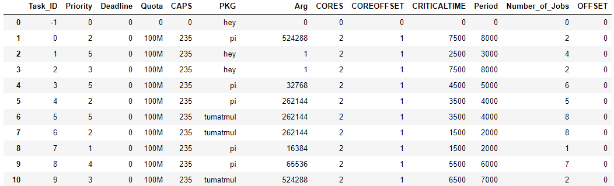
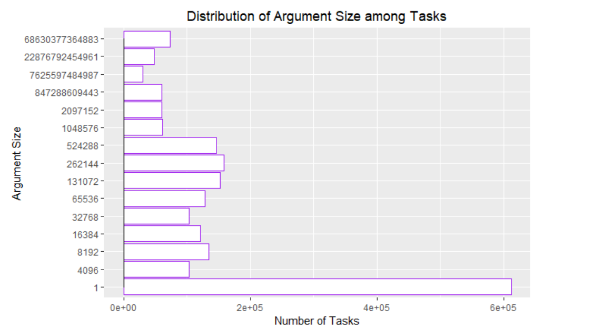
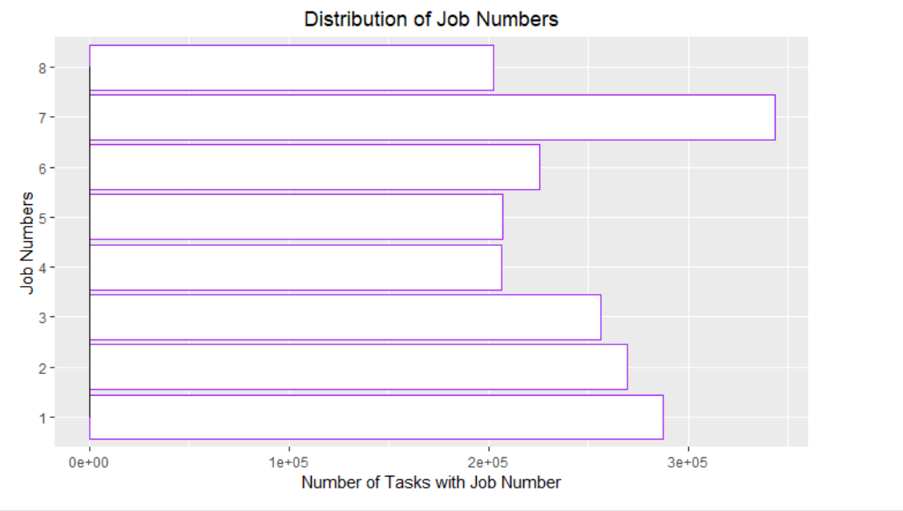
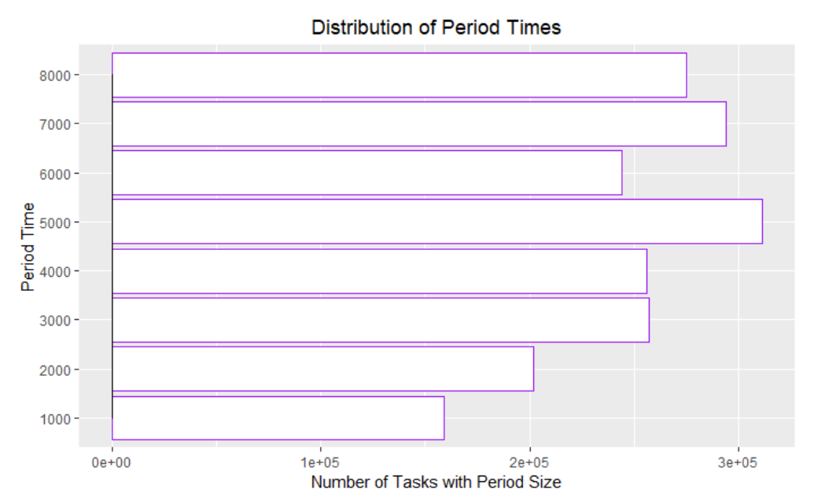
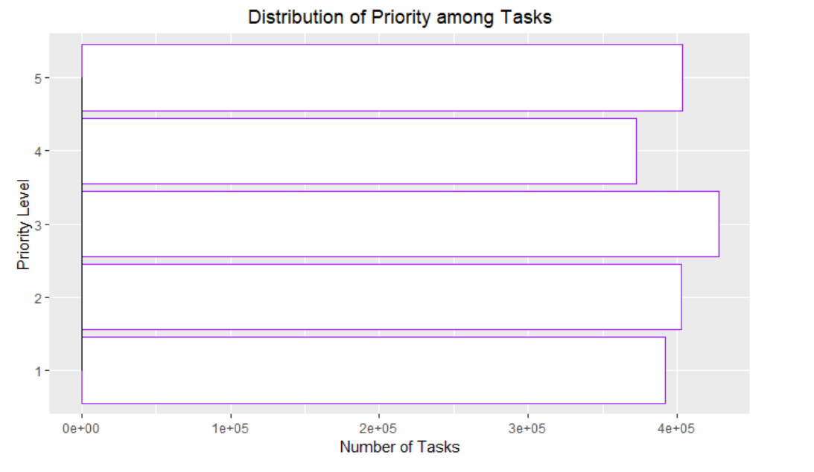

# Data Visualizations

To get an idea of how the data is distributed, we displayed the data and its hyperparameters using different visualization plots:

Here is an example of the first ten lines of the Task Table

Each task has a "Number_of_Jobs". Although the number of jobs is used as a parameter in the learning process, the tasks that are being deplayed all consists of Jobs. These Jobs are represented in the table below

 

 
 
Distribution of the main learning parameters are listed below:

 
 

 
 

 
 

