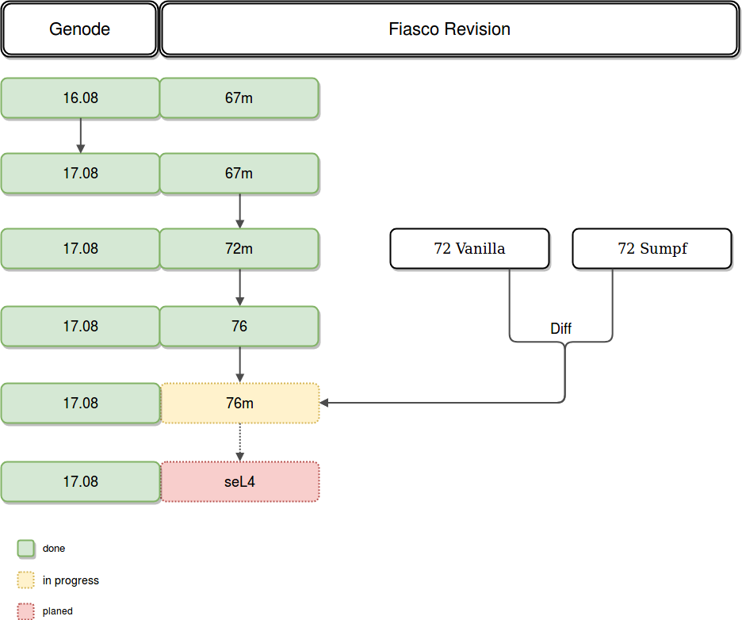

# Genode & Fiasco Update

This section covers the updates for Genode and Fiasco.OC. 

## Agenda

Starting with the Genode version 16.08 and Fiasco.OC revision 67m (_m_ stands for 
modified by the chair), the Genode version was updated first. After that the Fiasco.OC has been updated step by step.
Eventually the Fiasco.OC should be replaced by seL4.

## Setup 

To set up your system, please follow the steps on the [ArgOS-research website](https://argos-research.github.io/documentation/install.html).  
The newest versions of Genode and Fiasco.OC are available from this [github repository](https://github.com/FringsA/).
There is also an [issue](https://github.com/FringsA/foc/issues/1) describing the current state of the work.

## Commands

Here is an compilation of commands to compile and to work with the code:

lightweight OS without userland:  
`operating-system$ make -C build/genode-focnados_pbxa9/ run/X`

compiled images are in  
`operating-system/build/genode-focnados_pbxa9/var/run/dom0-HW$`

include repos are in  
`operating-system/build/genode-focnados_pbxa9/etc$ build.conf`

run hello_tutorial  
`operating-system$ make -C build/genode-foc_pbxa9/ run/hello`

create build directory  
`operating-system$ make jenkins_build_dir`

## Structure of directories

There are several directories in the path `operating-system/genode/contrib/foc-02548d06466a0c48d445decb8c42eced48181dfa/src/kernel`:  

- `foc` r76 working directory. The _make_ process uses this directory for the compilation of the kernel.   
- `foc_r72` original r72 version.  
- `foc_r72_andreas` working version of r72. Rename this folder to _foc_ in order to run a working kernel. Rename the current _foc_ direcctory before renaming the _foc_r72_andreas_ directory.  
- `foc_r72_sumpf` modified version of r72, taken from [here](https://github.com/ssumpf/foc).  
- `foc_r76_backup_modified` version with the applied diffs from r72 vanilla version and the r72 sumpf version, but without any further changes to make it compile.  
- `foc_r76_backup_unmodified` original version of the r76, taken via svn from [here](https://svn.l4re.org/repos/oc/l4re/trunk/).

