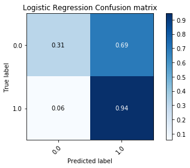

# Shallow Learning Results

## Current results from the pandas.v3 file

The results presented below will include both an even distribution of the data (equal amounts in each) and also how the data was presented regularly. 

For numerous reasons, k-fold cross-validatoin is the accepted technique for evaluating the performance of a classifier in the machine learning community. As there are numerous metrics for evaluating machine learning classifiers, it is imperative to utilize as many as possible to get the best idea of how well the classifier is performing. Given that the data contains about ~77.5% successful tasksets, a classifier can perform decently ( > 75% accuracy) by simply predicting the same label. As a result, we wanted to not focus on the accuracy, but rather on the distribution of the classifications. A good baseline classifier is one that can make some sort of distrinction between the good and bad tasksets based on the parameters we are using for evaluation (Priority, Number of Jobs, Period, Argument Size). 

The <b>Receiver Operating Curve (ROC)</b> measures the tradeoff between true positives and false positives. This graph can be used to analyze the expected number of <i>true positives</i> that we expect to get for every false positive. This graph is to provide a general overview on the expected performance of the classifieres. A general evaluation metric of <i>ROC</i> is to inspect the <b>Area under the Curve (AUC)</b>. A random classifier will have an <i>AUC</i> of .5 as this implies it is expected to get a correct classification for every incorrect classifiaction. A perfect classifier will have an <i>AUC</i> of about 1.0. Therefore, the closer the <i>AUC</i> is to 1.0, the more reliable in classifying tasksets.  For more information, see [here](https://de.wikipedia.org/wiki/Receiver_Operating_Characteristic)

In these examples, a 5-fold [Stratified](https://scikit-learn.org/stable/modules/generated/sklearn.model_selection.StratifiedKFold.html) Cross Validation was used to test the results on multiple <i>folds</i> of the data. In the <i>ROC</i> curves below, the individual as well as the average folds are displayed in the graph. When the folds cannot be distinguished, it is because they too similiarly to be distinguished. The confusion matrices are simply the averages of the 5 stratified folds. 

 Along with a measure of accuracy, we wanted to measure the recall rate (number of true/false positives). This would give a better idea on the pattern matching abilities of these algorithms. Along with the ROC Curves, we used the confusion matrix which shows the distribution of predicted labels. This will ensure that a model is not overfitting by only predicting a particular label most of the time over another. 

K-fold validation is the accepted metric in the machine learning community. The models were trained with a <i>stratified-k-fold</i> validation in that an effort was made to balance the samples in each class. Since there was a skey of <b>Successful</b> to <b>Unsuccessful</b> tasksets, the folds naturally had more data that was of <i>Successful</i> tasksets than of the other. 

Here are the results: 

Mondorian Forest: 

&nbsp;&nbsp;&nbsp;&nbsp;&nbsp;&nbsp;&nbsp;&nbsp;&nbsp;&nbsp;&nbsp;  

Random Forest: 

&nbsp;&nbsp;&nbsp;&nbsp;&nbsp;&nbsp;&nbsp;&nbsp;&nbsp;&nbsp;&nbsp;  

Logistic Regression: 

&nbsp;&nbsp;&nbsp;&nbsp;&nbsp;&nbsp;&nbsp;&nbsp;&nbsp;&nbsp;&nbsp;  

K-Nearest Neighbors (5-Uniform-Unweighted)

&nbsp;&nbsp;&nbsp;&nbsp;&nbsp;&nbsp;&nbsp;&nbsp;&nbsp;&nbsp;&nbsp;  

Gaussian Bayes:

&nbsp;&nbsp;&nbsp;&nbsp;&nbsp;&nbsp;&nbsp;&nbsp;&nbsp;&nbsp;&nbsp;  

Multinomial Bayes:

&nbsp;&nbsp;&nbsp;&nbsp;&nbsp;&nbsp;&nbsp;&nbsp;&nbsp;&nbsp;&nbsp;  

Bernoulli Bayes:

&nbsp;&nbsp;&nbsp;&nbsp;&nbsp;&nbsp;&nbsp;&nbsp;&nbsp;&nbsp;&nbsp;  

